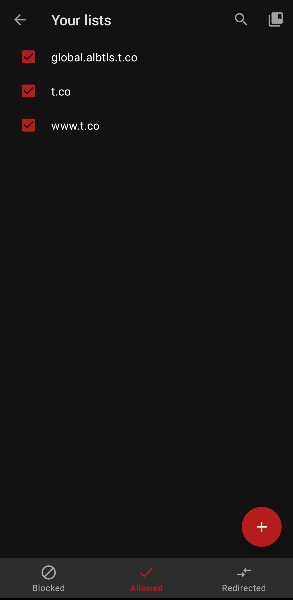
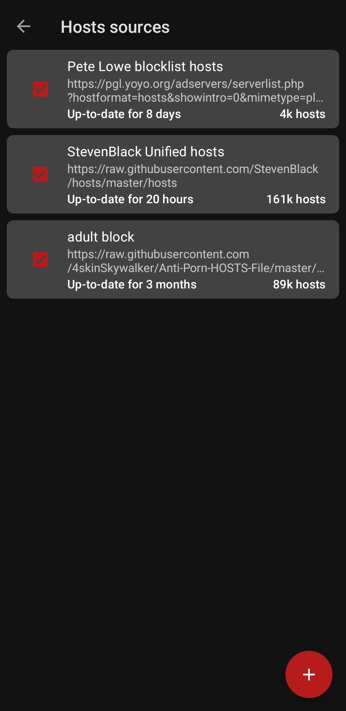

# 📱 List of Applications and Modules for Android

## Introduction

Welcome to my curated list of personal favorite tools for Android devices and Magisk modules.Feel free to contribute to this list by creating a pull request. Your contributions and suggestions are highly appreciated!🚀

## Applications

| Application                           | What It Does                                                                                          | Features                                                                                                                                                                                      | Requires Root | Download Link                                                                          | Setup Instructions |
| ------------------------------------- | ----------------------------------------------------------------------------------------------------- | --------------------------------------------------------------------------------------------------------------------------------------------------------------------------------------------- | ------------- | -------------------------------------------------------------------------------------- | ------------------ |
| **HMA (Hide My Applist)**             | Hides the presence of root from other applications, useful for banking apps and other sensitive apps. | - Blacklist/Whitelist specific apps - Hide root-related apps like Magisk, LSPosed, etc.                                                                                                    | Yes           | [GitHub](https://github.com/Dr-TSNG/Hide-My-Applist/releases)                          | [Go](#hma)         |
| **F-Droid or Droid-ify**              | Platforms for downloading a variety of APKs from open-source repositories.                            | - Secure and verified apps - Regular updates                                                                                                                                               | No            | [F-Droid](https://f-droid.org) [Droid-ify](https://github.com/Droid-ify/client)     |                    |
| **WaEnhancer**                        | Provides additional tools for WhatsApp, requiring the LSposed module.                                 | - Hide online status - Hide typing status - Hide read receipts - Disable delivery receipts - Etc.                                                                                 | Yes           | [GitHub](https://github.com/Dev4Mod/WaEnhancer)                                        |                    |
| **XMANAGER**                          | Module for downloading Spotify mods.                                                                  | - Ad-free experience - Unlimited skips                                                                                                                                                     | No            | [GitHub](https://github.com/Team-xManager/xManager)                                    |                    |
| **YouTubeAdAway**                     | Xposed module to remove ads from YouTube and enable background playback.                              | - Blocks ads in YouTube - Allows background playback of videos                                                                                                                             | Yes           | [GitHub](https://github.com/wanam/YouTubeAdAway)                                       |                    |
| **AdAway**                            | Ad-blocking app that works across apps and browsers.                                                  | - Blocks ads across apps and browsers - Customizable host sources for ad-blocking - Whitelist specific apps                                                                             | Yes           | [GitHub](https://github.com/AdAway/AdAway)                                             | [Go](#adaway)      |
| **ApplistDetector**                   | Module to detect apps that are trying to access the app list.                                         | - Detects apps trying to access the app list - Provides notifications for app access - Allows blocking of app access to the app list                                                    | Yes           | [GitHub](https://github.com/Dr-TSNG/ApplistDetector)                                   |                    |
| **InnerTune**                         | Module for streaming YouTube Music without ads and downloading songs for offline listening.           | - Stream YouTube Music without ads - Download songs for offline listening - Supports background playback - Supports unlimited skips                                                  | No            | [GitHub](https://github.com/z-huang/InnerTune/releases/latest)                         |                    |
| **Magisk**                            | Powerful root manager for Android devices.                                                            | - Systemless root - Magisk modules support - MagiskHide to bypass SafetyNet checks - BusyBox support - MagiskSU for root access - Magisk Manager app for easy management       | Yes           | [GitHub](https://github.com/topjohnwu/Magisk)                                          |                    |
| **Swift Backup**                      | Tool for backing up and restoring apps and their data.                                                | - Backup to cloud storage - Easy app data restoration - Batch backup and restore - Scheduled backups - Incremental backups - Backup encryption - Backup to external storage | No            | [Google Play](https://play.google.com/store/apps/details?id=org.swiftapps.swiftbackup) |                    |
| **TB Checker**                        | Module to check the safety of apps installed on your device.                                          | - Checks for malware and vulnerabilities - Provides safety ratings for apps - Scans for security issues - Checks for privacy concerns                                                | No            | [Google Play](https://play.google.com/store/apps/details?id=krypton.tbsafetychecker)   |                    |
| **Enable Screenshot.apk by Techneko** | Module that enables the screenshot feature on apps that disable it.                                   | - Enables the screenshot feature on apps - Allows taking screenshots on apps that disable it - Works with banking apps, payment apps, etc.                                              | Yes           | [GitHub](https://github.com/LSPosed/DisableFlagSecure)                                 |                    |

## Modules

| Module                            | What It Does                                                                                    | Features                                                                                                                                      | Download Link                                                                               |
| --------------------------------- | ----------------------------------------------------------------------------------------------- | --------------------------------------------------------------------------------------------------------------------------------------------- | ------------------------------------------------------------------------------------------- |
| **liboemcryptodisabler**          | Disables liboemcrypto.so, allowing playback of DRM-protected content on rooted Samsung devices. | - Disables liboemcrypto.so - Allows playback of DRM-protected content on rooted Samsung devices                                            | [GitHub](https://github.com/SkyN9ne/liboemcrypto-disabler?tab=readme-ov-file)               |
| **LSPosed mod zygisk**            | Fork of LSPosed that uses Zygisk to hide root from apps.                                        | - Hides root from apps - Supports Zygisk - Supports modules                                                                             | [GitHub](https://github.com/mywalkb/LSPosed_mod)                                            |
| **Shamiko**                       | Fork of LSPosed that uses Zygisk to hide root from apps.                                        | - Hides root from apps using Zygisk                                                                                                           | [GitHub](https://github.com/LSPosed/LSPosed.github.io/releases/tag/shamiko-344)             |
| **PlayIntegrityFix_v15.9.9**      | Module that fixes the Play Store's integrity check.                                             | - Fixes Play Store integrity check - Allows installation of apps that fail the integrity check                                             | [GitHub](https://github.com/chiteroman/PlayIntegrityFix)                                    |
| **playcurl**                      | Command-line tool for interacting with the Play Store.                                          | - Command-line tool for interacting with the Play Store                                                                                       | [GitHub](https://github.com/daboynb/PlayIntegrityNEXT/releases)                             |
| **BCR (Basic Call Recorder)**     | Call recording module for Android devices.                                                      | - Records calls automatically - Supports recording of incoming and outgoing calls - Supports recording of VoIP calls - Root required | [GitHub](https://github.com/chenxiaolong/BCR)                                               |
| **Unlimited Google Cloud Backup** | Magisk module that enables unlimited Google Cloud backups for Google Photos.                    | - Unlimited Google Cloud backups for Google Photos - No restrictions on backup size - No restrictions on backup quality                 | [GitHub](https://github.com/VehanRajintha/Free-Unlimited-Google-Cloud-Backup-Magisk-Module) |
| **safetynet-fix-v2.3.1-MOD_3.0**  | Module that fixes SafetyNet issues on rooted devices.                                           | - Fixes SafetyNet issues on rooted devices  - Bypasses SafetyNet checks  - Allows apps that require SafetyNet to function               | [GitHub](https://github.com/Displax/safetynet-fix/releases)                                 |

## Intructions

### HMA

1. Hide Magisk App: Open Magisk, go to settings, and select "Hide the Magisk App".
2. Install LSPosed Framework: Ensure you use the Zygisk version.
3. Install HMA: Download and install from GitHub.4. Setup Blacklist: Create a Blacklist template and add apps to hide.

### AdAway

Additional Hosts File Sources:

- **Note**: Add these URLs to allowed sources:

  - `-Global.albtls.t.co`
  - `-t.co`
  - `-www.t.co`

    []

- **Hosts File Sources**:

  - [Anti-Porn HOSTS File](https://raw.githubusercontent.com/4skinSkywalker/Anti-Porn-HOSTS-File/master/HOSTS.txt)
  - [StevenBlack's Hosts](https://raw.githubusercontent.com/StevenBlack/hosts/master/hosts)
  - [PGL Yoyo Ad Servers](https://pgl.yoyo.org/adservers/serverlist.php?hostformat=hosts&showintro=0&mimetype=plaintext)

    []
